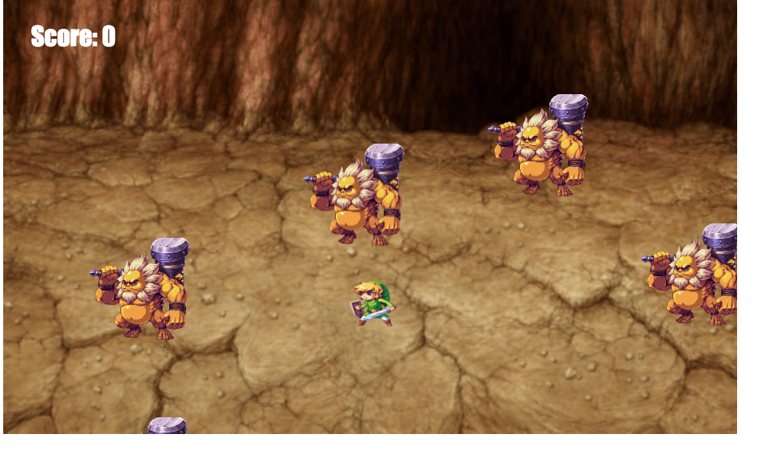

# canvasgameHTML5

# Game Instructions
Move the hero (elf with the sword) with the arrow keys. Rescue the orphan (little child with bird costume) while avoiding the goblins with hammars.

# Screenshot

[x] Milestones
[x]Got most of the stage and avatars setup with arrow key movements.
[x] Reimagined the goblin game with a rescue theme.
[x] Added the js file to detect when collisions happened, keep score, refresh/update/restart the game when orphan is caught.
[x] improved the visuals with different background and game sprites
[x] Improved sprite speed
